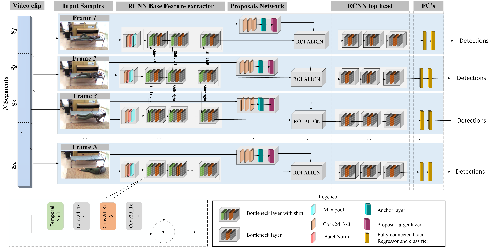

# S-RAD Single Run Action Detector - A Privacy Preserving Approach [[arXiV]](https://arxiv.org/abs/2102.03391)

# Introduction 
Single  Run  Action  Detector(S-RAD)is a real-time, privacy-preserving  action  detector that performs end-to-end action localization and classification. It is based on Faster-RCNN combined with  temporal shift  modeling  and  segment  based sampling to capture the human  actions. Results on UCF-Sports and UR Fall dataset present comparable accuracy to State-of-the-Art approaches with significantly lower model size and computation demand and the ability for real-time execution on edge embedded device (e.g. Nvidia Jetson Xavier). Our paper Pre-print can be found [here](https://arxiv.org/abs/2102.03391)

# Overview

We release the Pytorch Code of S-RAD:



# Table of Contents:
* [Preparation](#Preparation)
  * [Pre-Requisites](#Pre-Requisites) 
  * [Compilation](#Compilation)
* [Dataset Preparation](#Dataset-Preparation)
* [Training](#Training)
   * [UCF-Sports](#UCF-Sports) 
   * [UR-Fall](#UR-Fall) 
* [Testing](#Testing)
   * [UCF-Sports](#UCF-Sports) 
   * [UR-Fall](#UR-Fall) 
* [Results](#Results)
   * [UCF-Sports](#UCF-Sports) 
   * [UR-Fall](#UR-Fall) 
   * [Pre-trained Models](#Pretrained-Models)
* [Citation](#Citation)
* [Reference](#Reference)


## Preparation

First of all, clone the code
```
https://github.com/TeCSAR-UNCC/S-RAD-ActionLocalizationClassification.git
```

Then, move to the folder:
```
cd S-RAD
```

### Pre-Requisites

* Python 3
* Pytorch 1.4.0
* torchvision 0.5.0
* CUDA 10.1

### Compilation

Install all the python dependencies using pip:
```
pip3 install -r requirements.txt
```

Compile the cuda dependencies using following simple commands:

```
cd lib
python3 setup.py build develop
```

It will compile all the modules you need, including NMS, ROI_Pooing, ROI_Align and ROI_Crop. 

## Dataset Preparation

 1. Modify the dataset path , log directory , model directory in the config file to the path you are using:
 
      ```
      S-RAD/lib/model/utils/config.py
      ```
    All the model and dataset related parameters can be updated here in the config file according to the dataset and model used.
    
 2. The framelist of the two datasets are provided in the below path :
      ```
      S-RAD/dataset_config/UCF_Sports/frames_list/
      S-RAD/dataset_config/UR_falldataset/frame_list/
      ```
      Frames lists are in the format videopath, #of frames, Class label
    
 3. Change the path of the video in the framelist.txt files for all the dataset with the location that the dataset is stored in your environment
 
 3. The annotations for UR-Fall dataset is derived from the COCO pretrained on mmdetection and we had provided the bounding box annotation in the following path:
    
     ```
      S-RAD/dataset_config/UR_falldataset/annotation/
      S-RAD/dataset_config/UCF_Sports/ucfsports-anno/
      ```

## Train

Before training, set the right directory to save and load the trained models in *S-RAD/lib/model/utils/config.py* and modify the number of workers according to the batch size in the config file.

### UCF-Sports:

To train on UCF-sport with resnet50 with 8 segment per clip, simply run:

```
python3 trainval_net.py --dataset ucfsport 
                        --net res50 
                        --bs 3 --lr 0.01 
                        --lr_decay_step 60 
                        --cuda --num_segments 8 
                        --acc_step 2  --s 16 
                        --epochs 300 --loss_type softmax 
                        --shift --shift_div 8 
                        --shift_place blockres 
                        --tune_from kinetics_resnet50.pth --pathway naive
```
where 'bs' is the batch size with default 1,'s' is the session number to differentiate the training session,'epochs' is the value the maximum epoch,loss type is sigmoid by default, acc_step is the accumulation step (gradient accumulation is implemented), 'tune_from' is the checkpoint of kinetics 400 to perform transfer learning, shift_div channels/feature maps proportion, num_segments is the num of frames, pathway is naive by default **V100 GPU accomodated batch size of 3 (24 frames) at lr_rate 0.01 , lr_decay_step of 60** To obtain the result as reported in the paper freeze the first block of Resnet in RESNET.FIXED_BLOCKS_1 of config file at S-RAD/lib/model/utils/config.py

### UR_Fall Dataset:

To train on UR_Fall dataset with resnet50 with 8 segment per clip, simply run:
```
python3 trainval_net.py --dataset urfall 
                        --net res50 
                        --bs 4 --lr 0.02 
                        --lr_decay_step 20 
                        --cuda --pathway naive 
                        --num_segments 8 --acc_step 3  
                        --s 12 --epochs 80 
                        --loss_type softmax 
                        --shift --shift_div 8 
                        --shift_place blockres 
                        --tune_from kinetics_resnet50.pth
```
## Test

### UCF-Sports:

If you want to evaluate the detection performance of a pre-trained res50 model on UCF sports test set, simply run
```
python3 trainval_net.py --dataset ucfsport 
                        --net res50 
                        --bs 3 --cuda 
                        --num_segments 8 
                        --loss_type softmax
                        --shift --shift_div 8
                        --shift_place blockres
                        --checkpoint 37 --checksession 45 
                        --checkepoch 3 --r True
                        --evaluate --eval_metrics
                        --pathway naive
```
Specify the specific model session, checkepoch and checkpoint, e.g., SESSION=1, EPOCH=6, CHECKPOINT=416 and set the num_of_workers = 0 in the config file. 

### UR-Fall :

If you want to evaluate the detection performance of a pre-trained res50 model on UR Fall test set, simply run

```
python3 trainval_net.py --dataset urfall 
                        --net res50 --bs 3 
                        --cuda --num_segments 8 
                        --loss_type softmax 
                        --shift --shift_div 8 
                        --shift_place blockres 
                        --checkpoint 13 --checksession 13 
                        --checkepoch 41 --r True 
                        --evaluate --eval_metrics 
                        --pathway naive
```

## Results

### UCF-Sports

#### State-of-the-Art per class frame mAP comparison in UCFSports
Action Class | [Action_tubes](https://arxiv.org/abs/1411.6031) | [Learning_to_track](https://arxiv.org/abs/1506.01929) | [Multiregion](https://hal.inria.fr/hal-01349107v1/document)| [TCNN](https://arxiv.org/abs/1703.10664) | S-RAD 
-------|-------|-------|-------|-------|------
Diving | 75.79 | 60.71 | 96.12 | 84.37 | 99.90
Golf  | 69.29 |77.54 | 80.46 | 90.79 | 87.20 
Kicking | 54.60 | 65.26 | 73.48 | 86.48  | 76.00
Lifting |99.09 | 100.00 | 99.17 | 99.76 |99.96
Riding | 89.59 | 99.53 | 97.56 | 100.0 | 99.90
Run | 54.89 | 52.60 | 82.37 | 83.65 |89.79
Skate Boarding | 29.80 | 47.14 | 57.43 | 68.71 | 67.93
Swing1 | 88.70 | 88.87 | 83.64 | 65.75 | 88.78
Swing2 | 74.50 | 62.85 | 98.50 | 99.71 | 99.9
Walk | 44.70 | 64.43 | 75.98 | 87.79 | 40.71

#### Overall frame mAP at IOU 0.5 threshold comparison in UCF-Sports Action dataset
[Action_tubes](https://arxiv.org/abs/1411.6031) | [Learning to track](https://arxiv.org/abs/1506.01929) | [Multiregion](https://hal.inria.fr/hal-01349107v1/document)| [TCNN](https://arxiv.org/abs/1703.10664) | [ACTdetector](https://arxiv.org/abs/1705.01861) | [videocapsule_net](https://arxiv.org/abs/1805.08162) | S-RAD
-------|-------|-------|-------|-------|------|-------|
mAP | 68.09 | 71.90 | 84.51 | 86.70| 87.7 | 83.9 | 85.04


### UR-Fall

#### State-of-the-Art per frame comparison in UR Fall dataset

[Alaoui_et_al](https://ieeexplore.ieee.org/document/8863334) | [Lu_et_Al](https://ieeexplore.ieee.org/abstract/document/8295206) | [Cameiro_et_al](https://ieeexplore.ieee.org/document/8787213) | [Leite_et_al](https://ieeexplore.ieee.org/document/8999301)
------|-------|-------|-------|
Sensitivity | 100 | - | 100 | 100 | 100
Specificity | 95 | - | 98.61 | 98.77 | 93.75
Accuracy | 97.5 | 99.27 | 98.77 | 98.84 | 96.46

### Pretrained-Models
Dataset | Checkpoint | log
------|--------|------------
UCF Sports |  [link](https://drive.google.com/file/d/1igHX0fBfWY7TXDdIgLFHiDYhp4da3fvw/view?usp=sharing) | [txt](https://drive.google.com/file/d/1B_NzoIatKPFg30PGmWFUbFRSuLPat1vT/view?usp=sharing)
UR-Fall  | [link](https://drive.google.com/file/d/1rZlpL7PKTnwJqb_9HSneRiI23nr2hBpC/view?usp=sharing) | [txt](https://drive.google.com/file/d/1U5dO57jwWTL536h4IFlqCCm-hiHdLNgN/view?usp=sharing)
Kinetics-400 | [link](https://drive.google.com/file/d/1ZytjmOh3QAwEWKp67h_Pi43PiWjZ4iUL/view?usp=sharing) |  -

## Citation

If you did like to use S-RAD paper please use the3 followinf citation

```
@misc{saravanan2021single,
      title={Single Run Action Detector over Video Stream -- A Privacy Preserving Approach}, 
      author={Anbumalar Saravanan and Justin Sanchez and Hassan Ghasemzadeh and Aurelia Macabasco-O'Connell and Hamed Tabkhi},
      year={2021},
      eprint={2102.03391},
      archivePrefix={arXiv},
      primaryClass={cs.CV}
}
```
We also recommend citing TemporalShiftModule and Faster RCNN, which inspired this work

## Reference

The repository involves the usage of following methods:
* [Temporal Shift Module](https://arxiv.org/abs/1811.08383)
* [Faster R-CNN](https://arxiv.org/abs/1506.01497)
* [Temporal Segment Sampling](https://arxiv.org/abs/1608.00859)
